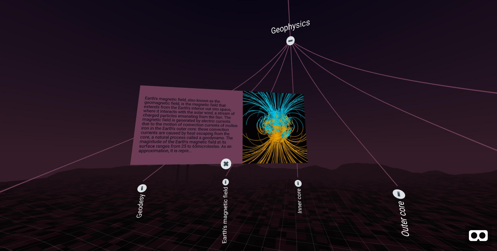

# Visualizing Wikipedia as a tree in VR

[](https://oscarmarinmiro.github.io/wikiTree/)

Just an experiment to research UI/UX for tree structures in VR. 

Live demo at https://oscarmarinmiro.github.io/wikiTree/

Data is taken from Wikipedia 'vital articles': https://en.wikipedia.org/wiki/Wikipedia:Vital_articles/Level/4. In bin/ you'll find a Python script using Beautiful Soup to generate the data

In www/ there's a parcel build system for an interactive VR demo, using AFrame+AFrame components and D3. Just run


For development server

```
npm install
npm run start 
```

To deploy

```
npm install
npm run build
```


